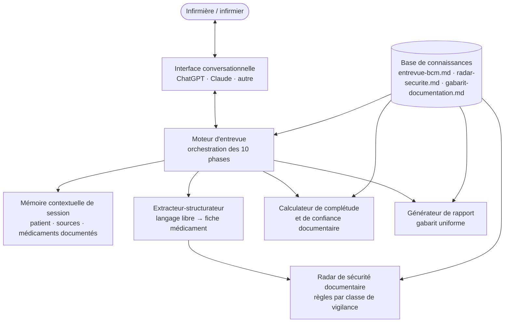

# 02 — Architecture fonctionnelle

## Vue d'ensemble

La version 1 est une **architecture de prompt** : un grand modèle de langage, des instructions système compactes (< 8 000 caractères, portables sur toute plateforme) et trois fichiers de connaissances qui portent la profondeur métier. Aucun code, aucune base de données, aucune persistance.

## Modules fonctionnels

| Module | Responsabilité | Source de vérité |
|---|---|---|
| **Moteur d'entrevue** | Suivre la conversation, garantir qu'à la fin les 10 phases sont couvertes, adapter le parcours au contexte (provenance, secteur, autonomie), regrouper les questions (max. 3 par tour). | `prompt/instructions-systeme.md` + `connaissances/entrevue-bcm.md` |
| **Mémoire contextuelle** | Retenir âge, provenance, secteur, autonomie, gestion des médicaments, rôle du professionnel, sources disponibles, médicaments déjà documentés. Interdire toute question redondante. | instructions système |
| **Extracteur-structurateur** | Transformer un énoncé libre en fiches médicament normalisées (générique (commercial), teneur, forme, voie, posologie et horaire réels, dernière prise, indication, source) ; détecter les champs manquants. | instructions système + gabarit |
| **Radar de sécurité documentaire** | Évaluer silencieusement chaque médicament capté contre les 10 fiches de vigilance ; émettre un rappel ciblé uniquement si pertinent pour ce patient. | `connaissances/radar-securite.md` |
| **Calculateur de complétude** | Calculer le % (catégories couvertes ÷ applicables) et le niveau de confiance documentaire (Élevé / Modéré / À consolider) selon des critères explicites. | `connaissances/gabarit-documentation.md` |
| **Générateur de rapport** | Produire le rapport final selon le gabarit unique, avec mention de l'assistance IA et espace de validation professionnelle. | `connaissances/gabarit-documentation.md` |

## Flux type d'une session

1. Ouverture : une seule question ouverte de mise en contexte.
2. L'infirmière parle librement ; l'extracteur structure ; la mémoire s'enrichit.
3. Le moteur d'entrevue relance uniquement sur les champs et catégories manquants ; le radar insère ses questions ciblées au moment naturel.
4. Aux jalons : indice de complétude et éléments manquants concrets.
5. Validation croisée avec les sources objectives ; divergences consignées, jamais tranchées.
6. Synthèse, indice final, rapport selon gabarit.
7. L'infirmière vérifie, valide, transcrit au dossier selon la procédure locale, puis supprime la conversation selon les règles locales.

## États d'une session

| État | Description | Transition |
|---|---|---|
| Nouveau BCM | Contexte non établi | → En cours dès la première réponse |
| En cours | Collecte active, mémoire à jour | → Interrompu ou → Clos |
| Interrompu / repris | L'infirmière colle le rapport partiel ; l'assistant réintègre l'état et poursuit sans redemander | → En cours |
| Clos | Rapport final produit | Conversation à supprimer après transcription |

## Exigences de plateforme (v1)

- Modèle de langage de niveau récent, solide en français québécois ;
- Instructions système d'au plus 8 000 caractères (contrainte la plus stricte du marché : champ « Instructions » d'un GPT personnalisé) ;
- Prise en charge de fichiers de connaissances joints ;
- Mémoire de conversation dans la session ;
- **Aucune autre capacité activée** (pas de navigation web, pas d'exécution de code, pas de génération d'images) : la sobriété réduit la surface d'erreur ;
- Paramétrage de confidentialité : entraînement sur les données désactivé (voir `07-confidentialite.md`).

## Décisions d'architecture

| Décision | Justification |
|---|---|
| Prompt < 8 000 caractères + connaissances séparées | Portabilité totale (ChatGPT, Claude, autre) ; le prompt fixe le comportement, les connaissances portent la profondeur ; chaque couche évolue indépendamment. |
| Aucune persistance de données | Confidentialité par conception : le dossier officiel de l'usager est l'unique lieu de conservation ; la conversation est jetable. |
| Règles de complétude explicites et déterministes | Un indice explicable est un indice auditable — condition de crédibilité clinique. |
| Radar en fiches déclaratives | Réviseurs cliniques (pharmacien, infirmière-conseil) peuvent lire, corriger et versionner les fiches sans toucher au prompt. |
| Français québécois natif | Vocabulaire du terrain (pilulier, Dispill, DSQ, FADM, MVL, PSN) — condition d'adoption. |

## Évolutions d'architecture envisagées

Application dédiée (interface structurée + conversation), lecture d'étiquettes et de listes par photo avec anonymisation, dictée vocale, intégrations institutionnelles (DME, DSQ) avec authentification et journalisation : voir `08-evolution.md`. Chacune de ces marches exige un cadre de gouvernance et de conformité supérieur — elles ne sont pas des « fonctionnalités à ajouter », mais des changements de catégorie de produit.
